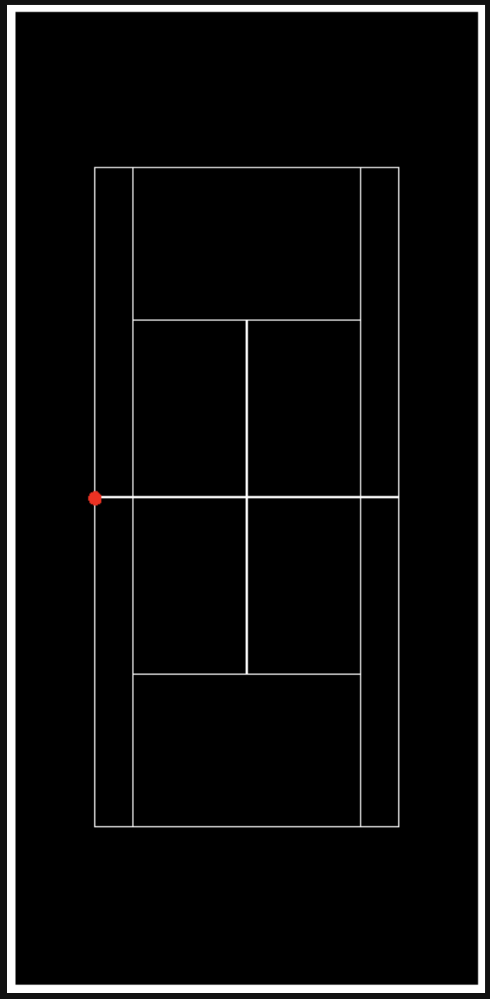

# Sparkd-Tennis

Given a tennis match video, our API is able to detect and track across time:
* the tennis court
* the players
* the balls

## Input
* Video of a tennis match

## Output
1. json file with all frame-by-frame collected data
2. video showing the results of our algorithm
3. map of the history of the match seen from above

### Output json - example
For each frame you the position of the ball and of the playes both in pixels and meters terms considering the middle-left point of the court as origin of our reference system (read point in the image below). Like in the example bleow:
```json
{
   "0":{
      "ball":{
         "x":408,
         "y":480,
         "x_meters":4.094931381518756,
         "y_meters":4.817566331198536
      },
      "plyr1":{
         "x":592.2884217322278,
         "y":1155.6544202183013,
         "x_meters":5.944559914366458,
         "y_meters":11.598837136134279
      },
      "plyr2":{
         "x":1291.9669495475773,
         "y":-2137.3021405362415,
         "x_meters":12.966950994086847,
         "y_meters":-21.451239233012416
      }
   },
   "1":{
      "ball":{
         "x":411,
         "y":496,
         "x_meters":4.125041171088746,
         "y_meters":4.978151875571821
      },
      "plyr1":{
         "x":595.324511636396,
         "y":1135.702461258733,
         "x_meters":5.975031923743152,
         "y_meters":11.398587374207045
      },
      "plyr2":{
         "x":1288.9312987784303,
         "y":-2138.498274642037,
         "x_meters":12.936483392131182,
         "y_meters":-21.46324434842008
      }
   }
}
```


